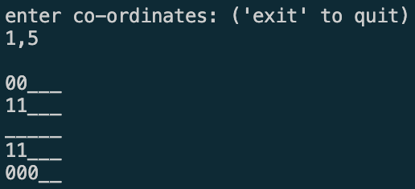
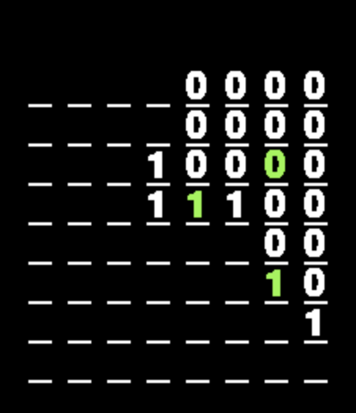

## minesweeper
Little test project - simple minesweeper game implementation

### Rules
- Click on any tile to reveal it
- Revealed tiles will indicate how many bombs are in adjacent tiles (including diagonals)
- If you click on a bomb tile, the game ends
- If you reveal all non-bomb tiles, you win
- Tiles with a low number of adjacent bombs will cascade & display other nearby tiles with a low count

### Instructions to run

**Prerequisites**
- Have python installed
- Have pip installed
- Install requirements with the following command:
``` bash
# cd into this folder before running
pip install -r requirements.txt
```

1. Run in the terminal with:
``` bash
# run in the terminal
python grid.py
```

_Use the terminal to enter which co-ordinates you would like to select_



2. Run via pygame with:
``` bash
# run via pygame
python minesweeper.py
```
_Click on the screen to reveal a tile_




3. Run the test suite with:
``` bash
# run tests
pytest
```